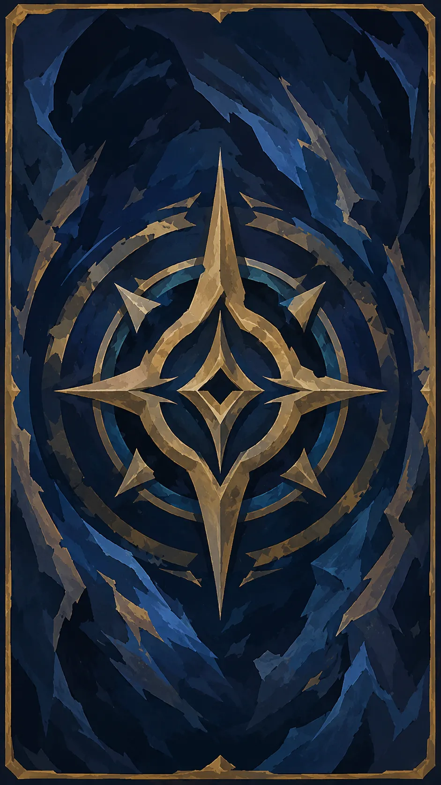
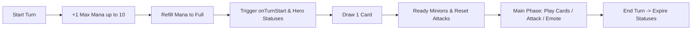
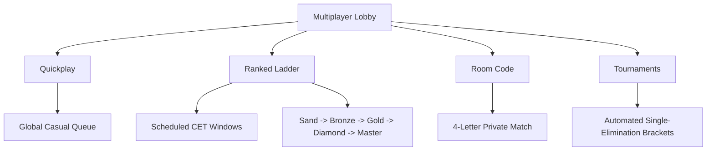
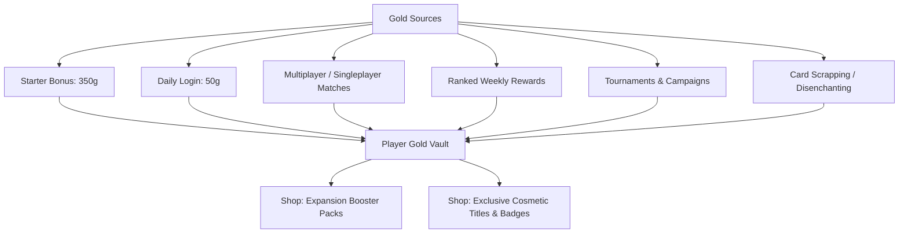

# Arcana TCG (Duelo Arcano)

<p align="center">
  
</p>

<p align="center">
  <strong>A high-performance, real-time multiplayer Trading Card Game (TCG) with an authoritative WebSocket server, responsive browser client, Discord Activity integration, and deep strategic combat.</strong>
</p>

<p align="center">
  
  
  
  
  
  
  
</p>

---

## 🌟 Overview

**Arcana TCG** is a competitive, expandable digital card game built from the ground up for instantaneous response times and 24/7 global accessibility. Powered by a deterministic, authoritative game engine shared seamlessly between **Node.js** and the **browser**, matches can be played across a worldwide dedicated server or 100% offline.

### Key Highlights
- 🌐 **Global Dedicated Server**: Persistent multiplayer running 24/7 behind Cloudflare and Oracle Cloud with sub-second WebSocket synchronization.
- ⚔️ **Extensive Game Modes**:
  - **Quickplay**: Global casual 1v1 matchmaking with real-time queues and rankings.
  - **Ranked Ladder**: Scheduled competitive windows (CET) with MMR rating progression, rank tiers (*Sand* to *Master*), weekly rewards, and seasonal resets.
  - **Private Rooms**: 4-letter join codes for direct duels with friends.
  - **Automated Tournaments**: Scheduled single-elimination brackets with automatic seedings, byes, 3rd-place matches, and gold prize pools.
  - **Story Campaigns (PvE)**: Multi-stage boss encounters with unique mechanics (The Protector, Iron Watch, FireElemental, and Mimic).
  - **Shield Trials (Real-Time Minigame)**: In-combat projectile blocking minigame requiring directional reflexes (WASD / Arrows / Touch).
  - **Practice vs NPC (100% Offline)**: Local heuristic AI opponent playable with zero dependencies and bundled local fonts.
- 🪙 **Complete Economy & Trading**:
  - Gold economy rewarded through duels, daily logins, campaigns, ranked tiers, and tournaments.
  - Booster packs with custom drop weightings and a **5-Pack Pity Protection System**.
  - **Card Scrapping / Disenchanting** for duplicate conversion.
  - **Direct P2P Trading**: Live peer-to-peer card exchange with active deck copy lock protection.
- 🎴 **Deck Builder & Collection**:
  - Interactive collection viewer with 100% real-world SVG country flags.
  - Deck validator (25 cards, max 3 spells, rarity limits: 2x common/rare, 1x legendary/mythic/souvenir).
  - One-click **Auto-Deck Builder**.
- 🏆 **Player Identity & Discord Integration**:
  - Discord OAuth2 authentication with JWT secure cookies.
  - Play directly inside Discord Voice Channels via **Discord Embedded App SDK**.
  - 15+ Unlockable Titles and 25+ Badges with dynamic SVG heraldic seals.
  - Custom display names, level progression, match records, and public duelist profiles.
- 📦 **Modular Expansion System**:
  - Plugin-style modular card sets (`expansions/`) with strict schema validation and pack shop settings.
  - Card compiler CLI (`npm run cards:build`, `npm run cards:check`, `npm run cards:watch`).
- 📱 **Progressive Web App (PWA) & Audio Engine**:
  - Installable on mobile and desktop devices with responsive layout and touch controls.
  - Built-in sound manager with spatial SFX, adaptive music, and gesture audio unlock.

---

## 📖 Complete Game Rules & Combat Mechanics



### 1. Objective & Win Conditions
- Each hero begins with **30 Health**.
- Reduce the opposing hero to **0 Health** to win the match.
- If both heroes hit 0 Health simultaneously, the match results in a **Draw**.
- A player can **Surrender** at any moment via the surrender modal.

### 2. Mana Curve & Turn Flow
- Players start Turn 1 with **1 Mana Crystal**.
- At the start of each turn, maximum Mana increases by **+1** up to the **cap of 10 Mana**, and current Mana refills completely.
- Certain cards grant **Temporary Mana** (extra crystals for the current turn) or **Next-Turn Mana Bonuses**.
- **Turn Timer**: 
  - **40 seconds** per turn in Quickplay, Ranked, and Private Room matches.
  - **30 seconds** per turn in Tournaments.
  - A visual progress rope and audio countdown tick warn players when turn time runs low.

### 3. Opening Hand & Mulligan Phase
- **Player 1 (First)**: Draws **3 cards**.
- **Player 2 (Second)**: Draws **4 cards** + receives a bonus **Mana Spark** (`special:manaspark`, a 0-cost spell that grants +1 temporary Mana on use).
- **Mulligan Phase**: Before Turn 1 begins, both players have a dedicated window to select any number of cards in their initial hand to shuffle back into their deck and draw fresh replacements.

### 4. Hand & Deck Restrictions
- **Maximum Hand Size**: **10 cards**. If a player draws while their hand is full, the drawn card is discarded/burned and cannot be added.
- **Deck Size**: Exactly **25 cards**.
- **Deck Exhaustion**: When a deck runs out of cards, subsequent draws simply yield no card. There is no fatigue damage penalty.

### 5. Board Limits & Keyword Caps
- **Minion Capacity**: A player may control a maximum of **4 minions** on their board simultaneously. (Special summon effects can trigger a temporary overflow of up to 5 minions).
- **Taunt Limit**: Maximum **2 Taunt minions** active per side at any time.
- **Charge Limit**: Maximum **1 Charge minion** active per side at any time.
- Attempting to play or summon a minion exceeding these board or keyword limits is strictly prevented by the game engine.

### 6. Card Types & Rarities
| Type | Description |
| :--- | :--- |
| **Minion** | Deployed to the battlefield with **Attack** (⚔️), **Health** (❤️), **Race**, and optional **Keywords** / **Abilities**. Cannot attack on the turn deployed unless it has *Charge*. Combat damage between minions is simultaneous and mutual. |
| **Spell** | Cast directly from hand by paying Mana. Resolves its direct effect (Damage, Heal, Draw, AoE, Debuff, Steal, etc.) and leaves the board immediately. |

#### Rarity Tiers & Deck Building Limits:
| Rarity | Visual Border / Glow | Max Copies per Card | Max Total in Deck |
| :--- | :--- | :---: | :---: |
| **Common** | Stone Gray | 2 | Unlimited |
| **Rare** | Sapphire Blue | 2 | Unlimited |
| **Legendary** | Radiant Gold Glow | 1 | **3 total** |
| **Mythic** | Amethyst Purple Flame | 1 | **1 total** |
| **Souvenir** | Emerald Prismatic Glow | 1 | Unlimited |

> [!IMPORTANT]
> **Deck Construction Rules**: Every legal deck must contain **exactly 25 cards** and **at most 3 spell cards**.

---

### 7. Keywords
- 🛡️ **Taunt** (`taunt`): Enemies must target and attack minions with Taunt before they can attack non-Taunt minions or the enemy hero.
- ⚡ **Charge** (`charge`): The minion can attack immediately on the turn it enters play.
- ✦ **Divine Shield** (`divineShield`): Completely absorbs and negates the first instance of damage the minion would take. The shield breaks immediately after absorbing the hit.

---

### 8. Status Effects (All 9 Types)
Status effects can be applied via spells, battlecries, or triggered auras. Status badges and durations are displayed directly on the cards:

| Status | Badge | Duration Default | Effect & Mechanics |
| :--- | :---: | :---: | :--- |
| **Weakened** | `W` | 1 turn | Reduces current Attack by `value`. When the duration expires, the deducted Attack is automatically restored. |
| **Frozen** | `F` | 1 turn | Prevents the minion from attacking during its next turn. |
| **Silenced** | `X` | Permanent | Permanently removes all keywords (Taunt, Charge, Divine Shield) and disables all triggered, passive, and deathrattle abilities. |
| **Poisoned** | `P` | 2 turns | Deals `value` damage at the start of the affected minion's or hero's turn. Reapplying Poison refreshes the duration rather than stacking damage. |
| **Marked** | `!` | 2 turns | Adds `value` bonus damage to the *next* hit the minion takes, after which the mark is consumed. (Divine Shield absorbs before Mark triggers). |
| **Burning** | `B` | 1 turn | Deals `value` damage at the start of each turn. Reapplying Burning **stacks both the damage value and duration**. Applies to minions or heroes. |
| **Drunk** | `D` | 1 turn | When attacking, the minion randomly targets another valid minion on the board (friendly or enemy) instead of the selected target. |
| **Confused** | `?` | 1 turn | At the start of the turn, the minion has a percentage chance (`value%`) to attack a random friendly minion or miss entirely. |
| **Dodge** | `~` | Permanent | Grants a `value%` chance to completely evade incoming attack damage. Dodge can scale upon trigger events (up to a configurable cap). |

---

### 9. Ability Triggers
Cards can execute special logic upon specific in-game events:

| Trigger | Timing |
| :--- | :--- |
| `onPlay` | Triggers immediately when played from hand (after minion lands or spell resolves). |
| `onDeath` | Triggers when the minion's Health drops to 0 and it dies. |
| `onTurnStart` | Triggers at the start of the controlling player's turn for every alive minion with this ability. |
| `onAnyTurnStart` | Triggers at the start of *either* player's turn while alive on board. |
| `onAttack` | Triggers when this minion initiates an attack against any target. |
| `onAttackMinion` | Triggers specifically when this minion attacks an enemy minion. |
| `onAttacked` | Triggers when this minion is attacked by an enemy. |
| `onKillMinion` | Triggers when this minion destroys an enemy minion in combat. |
| `onEnemyMinionDeath`| Triggers whenever any enemy minion dies while this card is on board. |
| `passive` | Continuous persistent aura or condition (e.g., race damage reduction, immunities, summon blockers). |

---

### 10. Built-in Special Ability Effects
Over 45 modular effects are supported out-of-the-box by the authoritative engine:

| Ability Effect | Parameters | Description |
| :--- | :--- | :--- |
| `drawCards` | `value` | Draws `value` cards from the deck. |
| `drawNonLegendaryNonMythicCard` | — | Draws 1 non-Legendary, non-Mythic card from the deck. |
| `drawRandomDeckCards` | `value` | Draws `value` random cards from anywhere in the deck. |
| `gainTemporaryMana` | `value`, `firstPlayOnly` | Grants `value` bonus Mana for the current turn. |
| `grantNextTurnTemporaryMana` | `value` | Grants `value` bonus Mana at the start of next turn. |
| `addCardToHand` | `cardId` | Generates a specific card into hand. |
| `addRandomSpellToHand` | — | Generates a random spell from the card catalog into hand. |
| `stealRandomEnemyDeckCardToHand` | — | Steals a non-Mythic card from the enemy deck into hand. |
| `stealRandomEnemyHandNonMythicCardBuffed` | `buffPercent` | Steals a card from the enemy hand, buffs minion stats by `buffPercent%`, and cuts its Mana cost in half. |
| `stealRandomEnemyBoardMinion` | — | Mind controls a random enemy minion over to your board. |
| `stealEnemyBoardNonMythicMinions` | — | Transfers all non-Mythic enemy minions to your board. |
| `stealHealthFromRandomEnemyHandMinionAsAttack`| — | Drains 1 Health from a minion in the enemy's hand and adds +1 Attack to this card. |
| `damageAllEnemyMinions` | `value` | Deals AoE damage to all enemy minions. |
| `damageAllMinions` | `value` | Deals AoE damage to all minions on both sides. |
| `damageAllOtherMinions` | `value` | Deals AoE damage to all minions except this one. |
| `damageEnemyHero` | `value` | Deals direct damage to the opposing hero. |
| `damageRandomOtherEnemyMinionOrHero` | `value` | Deals repeated damage to another random enemy minion or the hero. |
| `damageSelfOnAttack` / `damageSelfOnTurnStart`| `value` | Self-inflicts recoil damage. |
| `healAllFriendlyMinions` | `value` | Heals all friendly minions for `value`. |
| `healFriendlyRaceMinions` | `race`, `value` | Heals friendly minions matching a specific race. |
| `healTargetMinion` | `value` | Targeted heal that can overflow max health. |
| `healSelf` | `value` | Increases current and max Health of this card. |
| `restoreSelfHealthToValue` | `value` | Restores current Health up to `value`. |
| `buffAllFriendlyMinions` | `attack`, `health` | AoE buff (+Atk / +HP) to all friendly minions. |
| `buffFriendlyRaceMinions` | `race`, `attack`, `health`| Buffs all friendly minions of a specified race. |
| `buffSelf` | `attack`, `health`, `maxApplications`, `maxAttack` | Buffs own stats with optional scaling caps. |
| `startDelayedSelfBuff` | `turns`, `attack`, `health`, `grantDivineShield` | Grants massive stat growth if the minion survives `turns`. |
| `swapSelfStatsIfBoardHasAtLeast` | `value` | Swaps Attack and Health if your board has at least `value` minions. |
| `summonMinion` | `cardId`, `count` | Summons copies of a minion directly onto your board. |
| `summonMinionIfMissing` | `cardId` | Summons a minion only if you don't already have one in play. |
| `grantDivineShieldToAllFriendlyMinions` | — | Grants Divine Shield to every friendly minion. |
| `grantDivineShieldToTargetMinion` | `target: "friendlyMinion"` | Grants Divine Shield to a chosen minion. |
| `grantSelfDivineShield` / `grantSelfCharge` / `grantSelfTaunt` | — | Self-applies keyword. |
| `grantRandomSelfKeyword` | `keywords` (optional) | Grants Taunt, Charge, or Divine Shield at random. |
| `grantChargeToRandomFriendlyNonCharge` | — | Grants Charge to a friendly minion that lacks it. |
| `grantDodgeToFriendlyBoardFirstPlay` | `value`, `selfValue` | Grants Dodge chance to the board upon initial deployment. |
| `increaseSelfDodgeOnEnemyDeath` | `value`, `maxValue` | Permanently increases Dodge % when an enemy dies. |
| `returnToDeck` / `returnEnemyMinionToDeck` | — | Bounces minion back into the deck with shuffle. |
| `returnAllMinionsToDeck` | — | Board wipe that returns all minions to decks. |
| `returnOtherFriendlyMinionsToHand` | — | Recalls allied minions back into your hand. |
| `rebirthWithHalfHealth` / `rebirthWithHealth` | `value` | Resurrects upon death with partial or fixed Health. |
| `transformIntoMinion` | `cardId` | Replaces the minion with another card. |
| `destroySelf` / `destroySelfIfPlayedAtLeast` | `value` | Destroys itself under condition. |
| `destroyRandomEnemyMinionChance` | `chance` | % probability to instantly destroy a random enemy minion. |
| `applyStatus` / `applyStatusToRandomEnemyMinion` / `applyStatusToAllEnemyMinions` | `status`, `value`, `turns`, `target` | Inflicts a status (Weakened, Frozen, Silenced, Poisoned, Marked, Burning, Drunk, Confused). |
| `applyDrunkToAttacker` / `applyBurningToAttacker` | `turns`, `value` | Retaliation debuff against attacking enemies. |
| `cleanseFriendlyMinion` | `target: "friendlyMinion"` | Cleanses all negative debuffs and statuses from an ally. |
| `reduceDamageFromRace` | `race`, `percent` | Defensive passive: reduces incoming damage from specific races (e.g. Monsters, Humans). |
| `blockKeywordSummons` / `blockChargeSummons` | — | Aura that prevents enemies from summoning Taunt or Charge units. |
| `immuneToAdverseEffects` | — | Immune to negative spells, status effects, and adverse enemy abilities. |
| `immuneToCardEffects` | — | Completely unaffected by other card effects (only vulnerable to direct combat attacks). |
| `unattackable` | — | Cannot be selected as a target for enemy attacks. |

---

### 11. Interactive Minigame: The Shield Trial
Certain encounters and cards (such as *TheUnchained* in Campaign Stage 2) trigger a real-time **Shield Trial**. 

```
          [▲ Up]
 [◄ Left] [🛡️ SHIELD] [Right ►]
         [▼ Down]
```
- A projectile arena appears on-screen with directional arrows flying toward your hero.
- Use **WASD**, **Arrow Keys**, or **On-Screen Directional Buttons** to rotate your shield.
- Successfully blocking arrows mitigates direct hero damage; missed arrows deal combat damage to your health.

---

## 🎮 Game Modes

### 1. Multiplayer 1v1



#### A. Quickplay (Casual Matchmaking)
- Instant queue that pairs any two online players globally.
- Wins and losses are tracked in player statistics and casual Quickplay Leaderboards.
- Earns match gold toward the daily multiplayer reward limit.

#### B. Ranked Ladder (Competitive Season)
- **Schedule**: Competitive windows open every weekend:
  - **Friday**: 18:00 – 19:00 CET
  - **Saturday**: 19:00 – 20:00 CET
  - **Sunday**: 21:00 – 22:00 CET
- **Rating Dynamics**:
  - **Victory**: `+150 MMR Rating`
  - **Defeat**: `-75 MMR Rating`
- **Rank Tiers**:
  | Rank Tier | Minimum Rating | Badge Color | Weekly Gold Reward |
  | :--- | :---: | :---: | :---: |
  | **Sand** | 0 | `#8ddcff` | 0 Gold |
  | **Bronze** | 400 | `#c8875b` | 150 Gold |
  | **Gold** | 900 | `#ffd166` | 300 Gold |
  | **Diamond** | 1500 | `#9de7ff` | 600 Gold |
  | **Master** | 2200 | `#d9a7ff` | 1200 Gold |
- **Season Resets**: Monthly season reset drops players by 2 rank tiers. Weekly rewards can be claimed directly from the Ranked Rewards modal.

#### C. Private Room Codes
- One player taps **Create room** to generate a unique **4-letter room code**.
- The second player enters the code and taps **Join**.
- Instant authoritative match startup upon connection.

#### D. Automated Tournaments
- Configured in [server/tournaments/catalog.js](server/tournaments/catalog.js) with UTC start times.
- **Bracket Engine**: Automatically creates a single-elimination bracket sized to registered entrants, placing automatic byes and scheduling a 3rd-place playoff match.
- **Prize Payouts**: 
  - 🥇 1st Place: 500 – 1200 Gold (+ exclusive custom cards/skins in special events)
  - 🥈 2nd Place: 250 – 600 Gold
  - 🥉 3rd Place: 100 – 300 Gold
- **Tournament Timers & Forfeits**:
  - **30 seconds** per turn.
  - **30 seconds** disconnect recovery grace period.
  - **3 minutes** match ready timeout (if one entrant fails to show, the waiting player advances by forfeit).
  - Responsive bracket viewer modal with mobile dropdown navigation and desktop podium tracker.

---

### 2. Singleplayer & PvE

#### A. Story Campaigns
Progressive campaign stages configured in [server/campaigns/index.js](server/campaigns/index.js):
1. **Stage 1: The Gates**: Fight *The Protector* (30 HP, 2 Starting Mana). Rewards **1 The Gates Mythic Card**.
2. **Stage 2: Iron Watch**: Face *TheUnchained* (30 HP) featuring the real-time **Shield Trial** arrow dodging trial. Rewards **250 Gold**.
3. **Stage 3: FireElemental**: Defeat the volcanic guardian *FireElemental* (25 HP, 3 Starting Mana) equipped with top Roads legendary/mythic power. Rewards a **Roads Expansion Card + 150 Gold**.
4. **Stage 4: Mimic**: A shape-shifting boss (40 HP) that **copies your exact deck, avatar, and identity**. Rewards **300 Gold**.

#### B. Practice vs NPC (100% Offline)
- Runs completely in the browser without server communication.
- Uses an efficient heuristic AI that evaluates board state, target priority, taunt blockers, and lethal calculations.
- Perfect for offline play, testing deck balance, and testing newly compiled expansions.

---

## 💰 Economy, Shop, Scrapping & Trading



### 1. Gold Currency & Limits
- **Starter Bonus**: **350 Gold** automatically granted on account creation.
- **Daily Login Bonus**: **50 Gold** on first login each day.
- **Discord Activity Invite Reward**: **100 Gold** bonus for launching the game inside Discord.
- **Match Rewards**:
  - *Singleplayer (PvE)*: Win = +10 Gold, Loss = +5 Gold (Daily cap: **80 Gold**).
  - *Multiplayer (Casual / Rooms)*: Win = +10 Gold, Loss = +5 Gold (Daily cap: **100 Gold**).
  - *Ranked*: Win = +20 Gold, Loss = +10 Gold.
- **Penalties**:
  - Surrender penalty (Multiplayer): `-10 Gold`.
  - Disconnect penalty (repeated offenses): `-20 Gold`.

### 2. Shop & Pack Opening
- **Default Booster Pack**: **20 Gold** for **5 cards**.
- **Expansion Packs**: Custom packs configured via `expansion.json` (e.g. Roads, The Gates, Core).
- **Rarity Drop Rates**:
  - ⚪ **Common**: `64.4%`
  - 🔵 **Rare**: `25.0%`
  - 🟡 **Legendary**: `8.0%`
  - 🟣 **Mythic**: `2.0%`
  - 🟢 **Souvenir**: `0.6%`
- **5-Pack Pity Protection System**: Opening 4 consecutive packs of an expansion without receiving a new card guarantees that the 5th pack will drop at least one uncollected card from that expansion.
- **Pack Opening Animation**: Full 3D card pack reveal experience with flip reveals and duplicate counters.

### 3. Card Scrapping (Disenchanting)
Convert surplus duplicate cards into gold:
| Card Rarity | Scrap Value |
| :--- | :---: |
| Common | **1 Gold** |
| Rare | **1 Gold** |
| Legendary | **2 Gold** |
| Mythic | **3 Gold** |
| Souvenir | **10 Gold** |

> [!TIP]
> **Active Deck Protection**: The system prevents players from scrapping cards currently assigned to active saved decks.

### 4. Real-Time Player-to-Player Trading
- Open the **Trade** menu to generate a secure **6-character Trade Code**.
- Share the code with another player to establish a private trading room.
- Both players select cards from their unlocked collection.
- The interface validates that neither player trades away the last copy of a card used in an active deck.
- Both duelists lock in and confirm; the server executes an atomic database transaction swapping ownership.

---

## 🗃️ Deck Builder & Inventory

- **Card Filter System**: Filter your collection by **Type** (Minion, Spell), **Rarity** (Common, Rare, Legendary, Mythic, Souvenir), **Country / Faction**, and **Race**.
- **100% SVG Country Flag Coverage**: Complete flags for all card factions and real-world countries.
- **Card Zoom View**: Inspect card artwork, stat distributions, active keywords, ability descriptions, country flags, and rich lore flavor text.
- **Deck Management**:
  - Create and save multiple custom decks.
  - Set active battle deck for Multiplayer, Ranked, and Campaign modes.
  - Built-in **Auto-Deck Generator** that creates an optimized legal 25-card deck from your owned collection.

---

## 👤 Player Profiles, Progression & Social

- **Discord Authentication**: Seamless login via Discord OAuth2. Pulls global avatar, username, and identity.
- **Custom Display Name**: Edit your in-game display name anytime from your profile (`PUT /account/display-name`).
- **Profile Statistics**: Track total wins, losses, surrenders, quickplay wins, NPC victories, tournament titles, and collection completion percentage.
- **Titles System**: Unlock and equip prestigious titles displayed in matches and lobbies (e.g. *Arcane Initiate*, *Duel Master*, *Ranked Vanguard*, *Tournament Sovereign*, *Johnny's Bane*, *Lord of the Cards*).
- **Heraldic Badges & Achievements**: 25+ achievement seals rendered with dynamic dual-tone SVG vectors (e.g. *First Victory*, *Endless Winter*, *Mythic Constellation*, *Base Archivist*, *Crown of Arcana*).
- **Support Arcana**: Creator support tier granting personalized custom Legendary/Mythic cards designed after the supporter and exclusive badges.
- **In-Game Card Request System**: Submit card proposals, balance ideas, and lore directly to the development team (`POST /card-requests`).
- **In-Match Emote Wheel**: Send animated emotes to opponents during combat.

---

## 🧩 Card Expansion & Modding System

Cards are organized modularly in `expansions/`. Each subfolder is a self-contained card set with its own `expansion.json`:

```
expansions/
  _TEMPLATE_MINION.js    → Starter template for minion cards
  _TEMPLATE_SPELL.js     → Starter template for spell cards
  core/
    expansion.json       → { "id": "core", "name": "Set Base", "enabled": true, "shop": true }
    recluta-novato.js
    explorador-agil.js
  Expansion1/
  Expansion2/
  Roads/
  TheGates/
  campaign2/
```

> [!IMPORTANT]
> **Rarity & Card Submission Policy (Disclaimer)**:
> Community card submissions and Pull Requests are open for **Common**, **Rare**, and **Souvenir** cards. **Legendary** and **Mythic** cards are **strictly exclusive to the game creator** (reserved for special lore characters, campaign bosses, and tournament champion tributes). Community contributions attempting to add new Legendary or Mythic cards will not be accepted.

### 1. Card Definition Schema
#### Minion Card Example:
```js
// expansions/my-set/obsidian-golem.js
module.exports = {
  name: "Obsidian Golem",
  cost: 4,
  type: "minion",
  attack: 3,
  health: 6,
  race: "Construct",                     // Free-text race
  keywords: ["taunt"],                   // "taunt" | "charge" | "divineShield"
  rarity: "rare",                        // "common" | "rare" | "souvenir" (Legendary/Mythic are creator-exclusive)
  country: "Arcana",                     // Faction or country name
  lore: "Carved by hands no one remembers anymore.",
  image: "art/obsidian-golem.png",       // Optional image path in public/

  abilities: [
    { trigger: "onDeath", effect: "summonMinion", cardId: "core:recluta-novato", count: 1 }
  ],
};
```

#### Spell Card Example:
```js
// expansions/my-set/frost-nova.js
module.exports = {
  name: "Frost Nova",
  cost: 3,
  type: "spell",
  rarity: "common",
  country: "Arcana",
  lore: "A sudden wave of absolute zero.",

  abilities: [
    { trigger: "onPlay", effect: "damageAllEnemyMinions", value: 2 },
    { trigger: "onPlay", effect: "applyStatusToAllEnemyMinions", status: "frozen", turns: 1 }
  ],
};
```

### 2. Card Compiler CLI
Run the compiler whenever cards are added or modified:
```bash
npm run cards:build   # Validates all expansions and writes public/cards.js
npm run cards:check   # Runs strict schema validation without writing files
npm run cards:watch   # Automatically rebuilds on every file save in expansions/
```

### 3. Card Artwork Generation Guide

To maintain visual cohesion across all cards and expansions in **Arcana TCG**, all illustrations follow a distinct painterly, matte, flat-shaded art style.

#### 🎨 AI Generation Prompt Template
Use the following prompt when generating card art with Midjourney, DALL-E, Stable Diffusion, Imagen, or similar tools (replace `''INSERT HERE SUBJECT''` with your subject):

```text
Square trading card illustration (1:1), designed for a collectible card game named "Arcana". The artwork fills almost the entire card. No text, no logos, no symbols, no numbers, a slight golden border, no UI elements. **Style: Painterly digital hand-painted, semi-realistic but ultra simplified, FLAT SHADES with NO GRADIENTS, discrete value steps with MODERATE contrast range, IRREGULAR ORGANIC PAINT PATCHES, visible hand-cut brush shapes with uneven edges, posterized lighting with close neighboring tones, bold clear silhouette with gentle but readable value separation, large graphic shapes, implied material using 4-8 flat tones only, matte non-blended shading. no gradients, no soft blending, no airbrush look, no outline, no text, no yellow AI tone, no noise, no thin parts, no vector-clean shapes, strong colors, good contrast Background complements the subject without distracting from it. Professional collectible card game artwork. subject: ''INSERT HERE SUBJECT''
```

#### 📐 Image Specifications & Format
- **Aspect Ratio**: `1:1` (Square).
- **Resolution**: `512x512` to `1024x1024` px.
- **File Format**: `.webp` (recommended for lightweight asset delivery, ~60–150 KB; `.png`, `.jpg`, `.jpeg` also supported).
- **Storage Directory**: Place image files into `public/art/<CardName>.webp` (e.g. `public/art/ObsidianGolem.webp`).
- **Code Reference**: Set `image` relative to `public/` in the card definition:
  ```js
  image: "art/ObsidianGolem.webp",
  ```


---

## 🏛️ Technical Architecture

```
[ Browser / Mobile PWA / Discord Activity ]
                   │
         HTTPS / WSS (TLS)
                   │
           [ Cloudflare Proxy ]
                   │
        [ Oracle Cloud VM (Node.js) ]
         ├─ Express 5 REST API
         ├─ WebSocket Server (ws)
         ├─ Authoritative Engine (public/engine.js)
         ├─ Turn Timer & Reconnect Services
         └─ User Mutex Locks (userLocks.js)
                   │
        [ MongoDB Atlas Cluster ]
         ├─ users collection
         ├─ tournaments collection
         ├─ tournament_rewards collection
         └─ card_requests collection
```

### Multiplayer Resilience & Security
- **Deterministic State Machine**: `public/engine.js` runs identical logic on Node.js and browser. The server validates every card play, mana cost, target eligibility, and attack before broadcasting state updates.
- **Seamless Reconnection**: Disconnected players receive a secure, one-time ticket (`server/wsTicketService.js`) and have **60s (casual)** or **30s (tournament)** to reconnect without forfeiting.
- **User Concurrency Locks**: `userLocks.js` prevents race conditions or double-spending during inventory mutations, shop purchases, and card trades.
- **Connection Safeguards**:
  - `MAX_WS_CONNECTIONS` (default: 200)
  - `MAX_WS_SOCKETS_PER_IP` (default: 5)
  - `MAX_WS_SOCKETS_PER_USER` (default: 3)
  - Strict origin validation (`PUBLIC_APP_ORIGIN`, `WS_ALLOWED_ORIGINS`).
  - Rate limiters on all authentication and economy API endpoints.

---

## 🚀 Installation & Local Development

### Prerequisites
- [Node.js](https://nodejs.org/) (v18.0.0 or higher)
- npm (v9.0.0 or higher)

### 1. Clone & Install
```bash
git clone https://github.com/your-username/arcane-duel-tcg.git
cd arcane-duel-tcg
npm install
```

### 2. Configure Environment
Create a `.env` file from the example:
```bash
cp .env.example .env
```
*(For local testing without MongoDB or Discord, the game runs automatically in guest/local mode with zero configuration).*

### 3. Build Cards & Run Server
```bash
npm run cards:build
npm start
```
Open `http://localhost:8443` in your browser.

### 4. Running the Test Suite
```bash
npm run test:smoke         # Complete WebSocket match simulation
npm run test:tournaments   # Tournament brackets, seedings, and match flows
npm run test:ranked        # Ranked MMR calculations, schedules, and tiers
npm run test:audio         # Audio unlock and delivery verification
npm run test:pwa           # Service Worker and cache verification
```

---

## 🌐 Production Deployment Guide

### 1. Oracle Cloud Compute (Always Free VM)
1. Launch an Ampere A1 (ARM64) or E2.1.Micro (x86) instance running Ubuntu 22.04 LTS.
2. In the OCI Console, open **Port 80 / 443 / 8443** in your VCN's Security List.
3. In the VM OS, allow the port through iptables/ufw:
   ```bash
   sudo ufw allow 8443/tcp
   ```
4. Install Node.js 18+ and clone the repository:
   ```bash
   git clone https://github.com/your-username/arcane-duel-tcg.git /home/ubuntu/arcane-duel-tcg
   cd /home/ubuntu/arcane-duel-tcg
   npm install --omit=dev
   npm run cards:build
   ```
5. Install and enable the systemd service:
   ```bash
   sudo cp deploy/arcane-duel.service /etc/systemd/system/arcane-duel.service
   sudo systemctl daemon-reload
   sudo systemctl enable --now arcane-duel
   ```

### 2. Cloudflare (Domain, SSL & WebSockets)
1. Point your domain A record to your Oracle VM public IP with Proxy (Orange Cloud) **Enabled**.
2. Set SSL/TLS mode to **Full (strict)** or **Flexible**.
3. Cloudflare automatically proxies WebSocket connections out-of-the-box.

### 3. MongoDB Atlas Setup
1. Create a free cluster on [MongoDB Atlas](https://www.mongodb.com/atlas).
2. Whitelist your Oracle VM's public IP address.
3. Paste the connection string into `MONGODB_URI` in `.env`.

### 4. Discord Developer Portal (OAuth2 & Activities)
1. Go to [Discord Developer Portal](https://discord.com/developers/applications) → Create Application.
2. Under **OAuth2 → General**, copy **Client ID** and **Client Secret**.
3. Under **OAuth2 → Redirects**, add:
   `https://yourdomain.com/auth/discord/callback`
4. Generate a 48-byte hex secret for `JWT_SECRET`:
   ```bash
   node -e "console.log(require('crypto').randomBytes(48).toString('hex'))"
   ```

### 5. Automated CI/CD (GitHub Actions)
The repository includes an automated deployment workflow [`.github/workflows/deploy.yml`](.github/workflows/deploy.yml). Every push to `main` automatically builds, tests, packages, and deploys the release to your Oracle VM.

Configure these GitHub Secrets in your repository (`Settings -> Secrets and variables -> Actions`):
| Secret Name | Description |
| :--- | :--- |
| `ORACLE_HOST` | Public IP or hostname of your production VM |
| `ORACLE_SSH_KEY` | Private SSH key authorized for the VM |
| `ORACLE_USER` | SSH user (default: `ubuntu`) |
| `ORACLE_APP_DIR`| App path (default: `/home/ubuntu/arcane-duel-tcg`) |
| `ORACLE_SERVICE`| Systemd service name (default: `arcane-duel`) |

---

## ⚙️ Environment Variables Reference

| Variable | Default | Description |
| :--- | :---: | :--- |
| `PORT` | `8443` | Port the HTTP and WebSocket server listens on. |
| `NODE_ENV` | `development` | Set to `production` to enable secure session cookies. |
| `MONGODB_URI` | — | MongoDB Atlas connection URI. |
| `MONGODB_DB_NAME` | `arcane_duel` | Database name in MongoDB. |
| `MONGODB_MAX_POOL_SIZE` | `10` | Maximum connection pool size for MongoDB driver. |
| `DISCORD_CLIENT_ID` | — | Discord OAuth2 Client ID. |
| `DISCORD_CLIENT_SECRET` | — | Discord OAuth2 Client Secret. |
| `DISCORD_REDIRECT_URI` | — | OAuth2 Redirect URL (`https://yourdomain.com/auth/discord/callback`). |
| `DISCORD_OAUTH_SCOPES` | `identify` | OAuth2 scopes requested from Discord. |
| `DISCORD_ACTIVITY_INVITE_URL` | — | Direct invite URL for Discord Activity launch button. |
| `PUBLIC_APP_ORIGIN` | — | Production URL (e.g. `https://tcg.warera.wiki`) for origin verification. |
| `WS_ALLOWED_ORIGINS` | — | Optional comma-separated origins allowed to connect via WebSockets. |
| `MAX_WS_CONNECTIONS` | `200` | Global concurrent WebSocket connection ceiling. |
| `MAX_WS_SOCKETS_PER_USER` | `3` | Maximum concurrent sockets allowed per authenticated user ID. |
| `MAX_WS_SOCKETS_PER_IP` | `5` | Maximum concurrent sockets allowed per client IP address. |
| `JWT_SECRET` | — | Random secret key used to sign session cookies. |

---

## 📄 License
This project is licensed under the **ISC License**.
